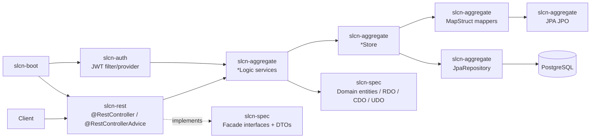
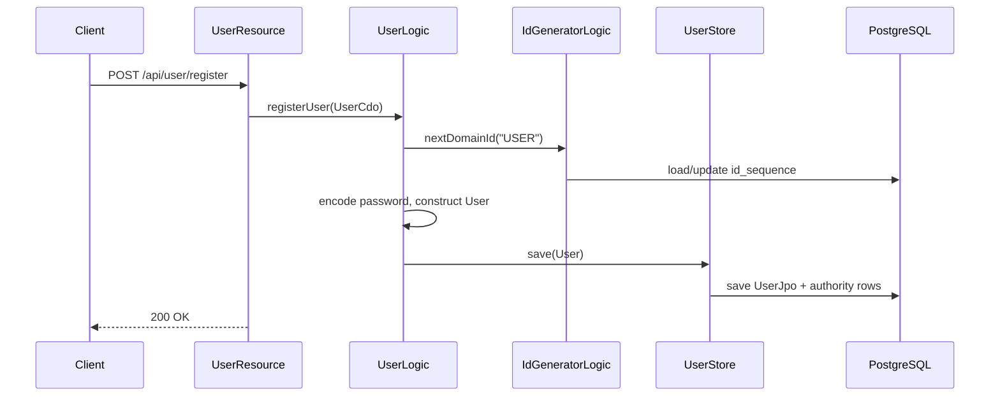

# Architecture Guide

> This document is for AI coding agents and developers working on this Spring Boot backend project.
> Code is the source of truth. If this document and code differ, verify the implementation before changing behavior.

## Analysis basis

- Inspected the multi-module Gradle build: `settings.gradle`, root `build.gradle`, and each submodule `build.gradle`.
- Read the actual implementation in `slcn-spec`, `slcn-aggregate`, `slcn-auth`, `slcn-rest`, and `slcn-boot`.
- Checked configuration in `slcn-boot/src/main/resources/application.yml`.
- Verified current test presence and build state with `./gradlew test` on 2026-03-23. Build succeeds; there are effectively no test sources.

---

## 1. Purpose

### What this project does

- Provides a Spring Boot REST backend for user registration/auth scaffolding, trip content, schedule management, and file handling.
- Exposes HTTP endpoints from `slcn-rest`, while keeping most business logic and persistence code in `slcn-aggregate`.
- Uses JWT-based stateless authentication and PostgreSQL-backed persistence.

### What this project does NOT do

- Does not use Kafka or any event broker.
- Does not currently contain implemented external HTTP API clients; Redis is configured, but no business code uses it yet.
- Does not currently expose trip, schedule, or file REST endpoints, even though contracts and business logic for those domains exist.

### How AI agents should use this document

- Read this before changing module boundaries, security, persistence mappings, or shared DTO/domain classes.
- Treat `slcn-spec` contracts and domain models as shared types with wider blast radius than `slcn-rest` or `slcn-boot`.
- Verify whether a feature is only specified in `slcn-spec` or actually wired through `slcn-rest` before modifying behavior.

### Agent work map

- Add a new HTTP API: `slcn-rest/src/main/java/com/seoulchonnom/rest/...`
- Add or change business logic: `slcn-aggregate/src/main/java/com/seoulchonnom/aggregate/.../logic/*Logic.java`
- Add or change persistence behavior: `slcn-aggregate/src/main/java/com/seoulchonnom/aggregate/.../store/*Store.java`, `.../repository/*Repository.java`, `.../mapper/*Mapper.java`, `.../store/jpo/*Jpo.java`
- Add or change shared request/response or domain shape: `slcn-spec/src/main/java/com/seoulchonnom/spec/...`
- Add or change JWT/security behavior: `slcn-auth/...` and `slcn-boot/.../SecurityConfiguration.java`
- Before changing any `slcn-spec` type, search all five modules for usages.

---

## 2. System Summary

### High-level summary

- Application type: Spring Boot REST API
- Main domain: user registration/auth scaffolding, trip content, schedule management, file storage
- Deployment type: modular monolith with a single boot application (`slcn-boot`)
- Runtime: Java 17 + Spring Boot 3.4.0
- Persistence: PostgreSQL via Spring Data JPA / Hibernate
- Secondary store: Redis configured in infrastructure, but no verified runtime usage in business flows
- External integrations: none verified beyond PostgreSQL, Redis, JWT signing, and local filesystem file storage

### Primary responsibilities

1. Register users and load authenticated principals from JWT claims.
2. Persist and retrieve trip and schedule domain data.
3. Provide common bootstrapping concerns such as security, Swagger, CORS, Redis, and application startup.

### Non-functional priorities visible in code

- Strong module separation by responsibility.
- Shared contract/domain reuse across modules.
- Simplicity over sophistication: mostly direct service-to-store-to-repository flows.
- API/security stability is important because auth is centralized and all non-whitelisted endpoints require `USER`.

---

## 3. High-Level Architecture

### Architecture style

- Modular monolith.
- Layered flow inside each feature: REST adapter -> logic/service -> store -> Spring Data JPA repository.
- Shared contract module (`slcn-spec`) used by most other modules.

### Main components

- `slcn-boot`: executable application and cross-cutting Spring configuration.
- `slcn-rest`: HTTP adapters and global web exception handlers.
- `slcn-auth`: JWT filter/provider and Spring Security user loading.
- `slcn-aggregate`: business logic, persistence stores, JPA entities, mappers, and domain-specific exceptions.
- `slcn-spec`: shared domain entities, facade interfaces, DTOs, constants, and contract-level response models.

### Diagram



### Notes

- Controllers are thin where implemented.
- Business logic is service-centric; there is no separate application/domain service split beyond `*Logic`.
- Persistence details are hidden behind `*Store`, not injected directly into controllers.

---

## 4. Package / Module Structure

### Module responsibilities

#### `slcn-spec`

- Responsibility: shared contracts and domain model.
- Contains:
  - Facade interfaces such as `UserFacade`, `TripFacade`, `ScheduleFacade`
  - DTO-like request/response classes under `facade.sdo`
  - Domain entities such as `User`, `Trip`, `Schedule`
  - Constants and common response model `ErrorResponse`
- Notes:
  - This module is not just API DTOs; it also owns core in-memory domain types.
  - Changes here propagate into `slcn-aggregate`, `slcn-auth`, and `slcn-rest`.

#### `slcn-aggregate`

- Responsibility: business logic and persistence implementation.
- Contains:
  - `logic`: service classes such as `UserLogic`, `TripLogic`, `ScheduleLogic`, `FileLogic`
  - `store`: repository adapters such as `UserStore`, `TripStore`, `ScheduleStore`
  - `store.jpo`: JPA entities
  - `store.mapper`: MapStruct mappers between `spec` domain objects and JPOs
  - `common`: base JPA superclasses, app-level exceptions, ID/password helpers
- Notes:
  - This is the effective domain/application layer and persistence layer combined.

#### `slcn-auth`

- Responsibility: authentication-specific infrastructure.
- Contains:
  - `JwtAuthenticationFilter`
  - `JwtTokenProvider`
  - `UserAuthDetailLogic` implementing `UserDetailsService`
  - `UserAuthStore`, which adapts `aggregate.user.store.UserStore` to Spring Security
- Notes:
  - Auth depends on aggregate stores; aggregate does not depend on auth.

#### `slcn-rest`

- Responsibility: HTTP adapters.
- Contains:
  - `UserResource`
  - `CommonExceptionHandler`
  - `CommonAccessDeniedHandler`
- Notes:
  - Only user endpoints are currently implemented.
  - Trip, schedule, and file contracts exist in `slcn-spec` but are not wired here.
  - New controllers should follow the existing pattern: implement the corresponding `slcn-spec` facade interface when one already exists.

#### `slcn-boot`

- Responsibility: application bootstrap and shared Spring configuration.
- Contains:
  - `SlcnappApplication`
  - `SecurityConfiguration`, `RedisConfig`, `WebConfig`, `SwaggerConfig`
  - `CommonAuthenticationEntryPoint`
  - `MultipartJackson2HttpMessageConverter`

### Representative package layout

```text
com.seoulchonnom
├─ boot
│  └─ common.config / entrypoint / converter
├─ rest
│  ├─ user
│  └─ common.handler
├─ auth
│  ├─ filter / util / logic / store
├─ aggregate
│  ├─ user / trip / schedule / file
│  └─ common
└─ spec
   ├─ user / trip / schedule / file
   └─ common
```

---

## 5. Dependency Rules

### Actual dependency direction

- `slcn-boot -> slcn-rest`
- `slcn-boot -> slcn-auth`
- `slcn-rest -> slcn-auth`
- `slcn-rest -> slcn-aggregate`
- `slcn-rest -> slcn-spec`
- `slcn-auth -> slcn-aggregate`
- `slcn-auth -> slcn-spec`
- `slcn-aggregate -> slcn-spec`

### Concrete dependency rules by layer

- `slcn-rest`
  - May depend on `slcn-spec`, `slcn-aggregate`, and `slcn-auth`.
  - Should contain Spring MVC annotations, request binding, response status shaping, and exception translation only.
  - Must not access `*Repository`, `*Jpo`, or MapStruct mapper classes directly.
- `slcn-aggregate/.../logic`
  - May depend on `slcn-spec`, feature `*Store`, and aggregate-common helpers such as `IdGeneratorLogic` and `PasswordGenerator`.
  - This is the primary place for business rules, validation that protects domain state, and transaction boundaries.
  - Must not contain `@RestController`, servlet APIs, or Spring Security filter code.
- `slcn-aggregate/.../store`
  - May depend on `slcn-spec` domain classes, local repositories, and local mappers.
  - Should translate between `slcn-spec` domain objects and JPA `*Jpo`.
  - Must not become a second business-service layer.
- `slcn-aggregate/.../store/repository`
  - Spring Data repository interfaces only.
  - Keep query methods here; keep orchestration out.
- `slcn-auth`
  - Owns token parsing/creation and `UserDetailsService`.
  - May read user data through `aggregate.user.store.UserStore`.
  - Must not own business rules unrelated to authentication.
- `slcn-spec`
  - Shared contracts and shared domain objects only.
  - Must stay free of JPA persistence annotations except where already used indirectly through shared enums/constants and Spring/OpenAPI annotations on facade contracts.

### Where to place new code

- New API endpoint for an existing domain:
  - facade contract: `slcn-spec/.../facade/*Facade.java`
  - request/response DTO: `slcn-spec/.../facade/sdo/*.java`
  - controller/resource: `slcn-rest/.../*Resource.java`
  - business logic: `slcn-aggregate/.../logic/*Logic.java`
  - persistence adapter: `slcn-aggregate/.../store/*Store.java`
  - JPA query/entity changes: `slcn-aggregate/.../store/repository`, `.../store/jpo`, `.../store/mapper`
- New auth rule:
  - URL-level rule: `slcn-boot/.../SecurityConfiguration.java`
  - token contents/parsing: `slcn-auth/.../JwtTokenProvider.java`
  - authenticated principal loading: `slcn-auth/.../UserAuthDetailLogic.java`, `UserAuthStore.java`
- New cross-cutting error mapping:
  - app exception type: `slcn-aggregate/.../exception`
  - HTTP mapping: `slcn-rest/common/handler/CommonExceptionHandler.java`

### Disallowed additions

- Reverse dependency from `slcn-aggregate` into `slcn-rest` or `slcn-boot`.
- Security-specific classes inside `slcn-spec`.
- Direct controller access to `UserRepository`, `TripRepository`, `ScheduleRepository`, or any `*Jpo`.
- New persistence logic inside `slcn-spec` domain entities.
- Business workflow code inside `CommonExceptionHandler`, `CommonAccessDeniedHandler`, or `SecurityConfiguration`.
- Duplicate DTO/domain types in `slcn-rest` that shadow `slcn-spec` without a clear reason.

---

## 6. Runtime Flows

### 6.1 User registration flow



### 6.2 Authenticated request flow

1. `slcn-boot.common.config.SecurityConfiguration#filterChain` disables CSRF, sets stateless session policy, and registers `JwtAuthenticationFilter`.
2. `slcn-auth.filter.JwtAuthenticationFilter#doFilter` reads header `X-AUTH-TOKEN`.
3. `slcn-auth.util.JwtTokenProvider#validateToken` verifies signature and expiration.
4. `JwtTokenProvider#getAuthentication` extracts claim `userName`.
5. `slcn-auth.logic.UserAuthDetailLogic#loadUserByUsername` delegates to `UserAuthStore#getUserDetail`.
6. `slcn-auth.store.UserAuthStore` reads the user via `aggregate.user.store.UserStore#findUserByUserName`.
7. `JwtAuthenticationFilter` stores the resulting `UsernamePasswordAuthenticationToken` in `SecurityContextHolder`.
8. Authorization is then enforced by URL matcher rules in `SecurityConfiguration`; non-whitelisted routes require authority `USER`.

### 6.3 Schedule read/write flow

- `slcn-spec.schedule.facade.ScheduleFacade` defines the intended HTTP contract, but no `slcn-rest` implementation exists.
- Actual implemented business path today:
  - reads: `ScheduleLogic#getSchedulesForNow`, `getSchedulesForMonth`
  - writes: `registerSchedule`, `modifySchedule`, `hideSchedule`, `deleteSchedule`
  - persistence: `ScheduleStore -> ScheduleRepository`
  - mapping: `ScheduleJpoMapper`
- Validation happens in `ScheduleLogic`, not in DTO annotations.
- Source of truth is PostgreSQL table `slcn.schedule` via `ScheduleJpo`.

### 6.4 Trip read/write flow

- `slcn-spec.trip.facade.TripFacade` defines the intended HTTP contract, but no `slcn-rest` implementation exists.
- Actual implemented business path today:
  - reads: `TripLogic#getAllTripList`, `getTripInfo`
  - writes: `registerTrip`
  - persistence: `TripStore -> TripRepository`
  - mapping: `TripJpoMapper`, `QuizJpoMapper`
- New trip IDs are allocated by `IdGeneratorLogic` from `slcn.id_sequence`.

### 6.5 File flow

- `slcn-spec.file.facade.FileFacade` defines the intended HTTP contract, but no `slcn-rest` implementation exists.
- Actual implemented business path today:
  - `FileLogic#uploadFile` -> `FileUtils#saveImages`
  - `FileLogic#getImageFile` -> `Files.readAllBytes`
- File validation and path filtering are in `FileUtils`, not in a controller.

---

## 7. Domain Model Overview

### Core domain objects

#### `com.seoulchonnom.spec.user.entity.User`

- Purpose: user account aggregate used for persistence and authenticated profile responses.
- Key fields: `id`, `username`, `name`, `password`, `authorityList`.
- Lifecycle:
  - created in `UserLogic.registerUser`
  - loaded in auth and user info flows
  - no delete/deactivate flow is implemented

#### `com.seoulchonnom.spec.trip.entity.Trip`

- Purpose: trip content aggregate with quiz metadata and map links.
- Key fields: `date`, `type`, `name`, `logo`, `firstMap`, `secondMap`, `driveUrl`, `quizList`.
- Lifecycle:
  - created in `TripLogic.registerTrip`
  - read in list/detail flows
  - no update/delete logic is implemented

#### `com.seoulchonnom.spec.schedule.entity.Schedule`

- Purpose: schedule/calendar aggregate.
- Key fields: `calendarId`, `title`, `start`, `end`, `category`, `state`, visibility flags, styling fields.
- Lifecycle:
  - created from `ScheduleCdo`
  - updated from `ScheduleUdo`
  - hidden by setting `isVisible=false`
  - deleted physically by repository delete

#### `com.seoulchonnom.spec.user.entity.Authority`

- Purpose: role grant embedded under `User`.
- Key fields: `role`, `registeredTime`.
- Lifecycle:
  - default authority is `USER` when a `User` is created
  - no role management flow is implemented

### Domain invariants visible in code

- New users receive a generated ID and a default `USER` authority.
- Schedule month queries only accept year `1900..2100` and month `1..12`.
- Schedule create/update requires datetimes parseable by `yyyy-MM-dd HH:mm:ss`.
- File uploads only allow paths matching `logo|map` and extensions matching `jpg|png|jpeg|gif|svg`.

### Important business rules

- User passwords are encoded before persistence.
- Missing or invalid user lookup maps to `InvalidUserException`.
- Schedule hide is soft-delete-like at domain level (`isVisible=false`), while delete is hard delete.

### Needs verification

- Whether `Trip` and `Schedule` entities are intended to be true aggregates with invariants beyond current field copying.
- Whether login-failure tracking in `UserLogin` / `UserLoginHistory` docs is planned or partially removed; no live persistence path uses them.

---

## 8. Persistence Model

### Primary database

- Type: PostgreSQL
- ORM: Spring Data JPA / Hibernate
- Query tools: derived repository methods only; no QueryDSL/MyBatis/JdbcTemplate found

### Persistence structure

- JPA entities are under `slcn-aggregate/.../store/jpo`.
- Repository interfaces are under `slcn-aggregate/.../store/repository`.
- Mapping between persisted JPOs and `slcn-spec` domain objects is done by MapStruct interfaces under `slcn-aggregate/.../store/mapper`.

### Source of truth

- Source of truth for business data: PostgreSQL tables in schema `slcn`.
- ID sequencing source of truth: `slcn.id_sequence`.
- Cache store: Redis is configured, but no verified feature uses it.
- Read-optimized projection store: none verified. `TripListPdo`, `QuizPdo`, `UserLoginDoc`, and `UserLoginHistoryDoc` are present but unused.

### Transaction boundaries

- Transactions start in `slcn-aggregate` logic classes and in `IdGeneratorLogic`.
- Class-level default is `@Transactional(readOnly = true)` on `UserLogic`, `TripLogic`, and `ScheduleLogic`.
- Write methods override with method-level `@Transactional` in `UserLogic.registerUser` and `TripLogic.registerTrip`.
- `ScheduleLogic` mutating methods are not explicitly annotated, but because they live in a class-level `@Transactional(readOnly = true)` service, they still participate in a transaction marked read-only unless Spring/Hibernate behavior is overridden elsewhere.
- `IdGeneratorLogic.nextDomainId()` mutates `IdSequence` inside its own transaction.

### What to check before changing write paths

- If adding a new write method to a `*Logic` class that already has `@Transactional(readOnly = true)` at class level, add method-level `@Transactional` deliberately.
- If changing ID generation, inspect both `IdGeneratorLogic` and `IdSequence`.
- If modifying entity relationships, verify the store mapper and repository query paths together; there is no test safety net.

### Query strategy

- Simple CRUD and list retrieval use Spring Data derived methods:
  - `UserRepository.findUserJpoById`, `findUserJpoByUsername`
  - `TripRepository.findAllByOrderByDateDesc`, `findById`
  - `ScheduleRepository.findAllByStartBetweenAndIsVisible`, `findById`
- No dedicated query/read model layer exists.

### Important notes

- `spring.jpa.hibernate.ddl-auto=update` means schema shape can change from entity changes at runtime. Treat JPO changes as high-risk.
- JPA relationships use a mix of `ElementCollection` and `@OneToMany`.
- `TripJpo.quizList` uses `mappedBy = "tripId"` against a scalar field in `QuizJpo`, not an entity association. This compiles, but mapping semantics should be treated as fragile and verified before refactoring.

---

## 9. External Integrations

### PostgreSQL

- Purpose: primary persistence store.
- Integration points: Spring Data repositories in `slcn-aggregate`.
- Authentication method: datasource username/password from environment variables.

### Redis

- Purpose: infrastructure capability only at present.
- Client location: `slcn-boot.common.config.RedisConfig`.
- Verified usage: none in business code.
- Needs verification: whether Redis is intended for refresh tokens, login throttling, or caching; current code does not use `RedisTemplate`.

### Local filesystem

- Purpose: uploaded image storage.
- Integration points: `FileUtils`, `FileLogic`.
- Root path: `upload.path` from configuration.

### JWT signing

- Purpose: stateless authentication token creation and verification.
- Integration points: `JwtTokenProvider`.
- Secret source: `spring.jwt.secretKey`.
- Notes:
  - Access token contains `userName`.
  - Refresh token contains no user claim.
  - Refresh-token persistence/rotation is not implemented in current code.

---

## 10. Security Model

### Authentication

- Mechanism: JWT in custom header `X-AUTH-TOKEN`.
- Entry point: `JwtAuthenticationFilter` registered in `SecurityConfiguration`.
- Principal model: `UserDetail` wrapping `spec.user.entity.User`.

### Authorization

- Enforced in `SecurityConfiguration` by URL matcher rules.
- Whitelisted paths:
  - `/swagger-ui/**`
  - `/v3/**`
  - `/user/login`
  - `/user/token`
  - `/user/register`
  - CORS preflight
- All other requests require authority `USER`.
- Method security annotations are not used.

### Sensitive data

- Sensitive fields: password, JWT secret, access token, refresh token.
- Passwords are encoded before persistence.
- Logging rules are minimal in code; auth errors are logged with `localizedMessage`, but tokens themselves are not logged.

### Important caveats

- `CommonAuthenticationEntryPoint` returns HTTP 403 for authentication failures, not 401.
- `UserDetail.getPassword()` returns `null`, so username/password authentication is not wired for Spring Security form login. Current login flow must be custom, but `UserResource.loginUser()` is not implemented.
- `SecurityConfiguration` contains an inline `TODO` indicating security rules are not considered final.

---

## 11. Configuration Model

### Configuration sources

- `slcn-boot/src/main/resources/application.yml`
- Environment variables:
  - `SLCN_POSTGRESQL_URL`
  - `SLCN_POSTGRESQL_USER`
  - `SLCN_POSTGRESQL_PW`
  - `SLCN_REDIS_URL`
  - `SLCN_REDIS_PORT`
  - `SLCN_REDIS_PW`
  - `SLCN_JWT_SECRETKEY`
  - `SLCN_UPLOAD_PATH`

### Profiles

- Default profile:
  - Swagger UI disabled
  - context path `/api`
- `dev` profile:
  - Swagger UI enabled at `/api-test`
- No separate `local`, `stage`, or `prod` YAML files were found.

### Important config classes

- `SecurityConfiguration`: stateless security filter chain and path authorization.
- `RedisConfig`: `RedisConnectionFactory` and `RedisTemplate<String, Object>`.
- `WebConfig`: permissive CORS for all origins and methods `GET, POST, PUT, DELETE, OPTIONS`.
- `SwaggerConfig`: OpenAPI bean.
- `MultipartJackson2HttpMessageConverter`: custom octet-stream converter bean.

### Notes

- CORS is globally permissive (`allowedOrigins("*")`).
- `spring.mvc.pathmatch.matching-strategy=ant_path_matcher` is explicitly set.
- `ddl-auto=update` makes entity refactors configuration-sensitive.

---

## 12. Error Handling Strategy

### Exception model

- Domain/application exceptions live mainly under `slcn-aggregate.common.exception` and feature-specific exception packages.
- `CommonExceptionHandler` in `slcn-rest` maps:
  - `BadRequestException` -> 400
  - `InternalServerErrorException` -> 500
  - `PayloadTooLargeException` -> 413
  - `UnsupportedMediaTypeException` -> 415
  - `HttpMessageNotReadableException` -> 400
- Security exceptions bypass that handler and use:
  - `CommonAuthenticationEntryPoint`
  - `CommonAccessDeniedHandler`

### Rules

- Throw feature-specific runtime exceptions from logic/store layers; let global handlers shape the response.
- Do not manually build JSON error payloads in controllers unless handling is intentionally controller-local.
- If adding a new exception type, either subclass an already-mapped base exception or extend `CommonExceptionHandler`.

### Gaps

- There is no catch-all `Exception` handler.
- Bean validation is not actively enforced on DTOs; DTO classes have no `@Valid` constraints.

---

## 13. Observability

### Logging

- Logging framework: Spring Boot default logging stack.
- Verified structured tracing/correlation: none.
- Explicit logs found:
  - Redis connection info on startup
  - auth/access denied localized messages

### Metrics

- None verified. No Micrometer/Prometheus-specific configuration found.

### Tracing

- None verified. No OpenTelemetry/Sleuth setup found.

### Operational implication

- Failures outside mapped handlers fall back to default Spring logging behavior.
- Security and Redis have some logging, but business flows have almost none.

---

## 14. Testing Strategy

### Current state

- `./gradlew test` passes.
- No `src/test/java` sources were found in the root project or submodules.
- Effective strategy today is compile-only verification, not behavioral test coverage.

### What this means for changes

- Any change to security, persistence mapping, or DTO serialization is high-risk because there is no automated regression coverage.
- Agents should add focused tests when modifying:
  - JWT/security behavior
  - JPA mappings and repository queries
  - DTO field names and JSON compatibility
  - transaction-sensitive write paths

### Where new tests should go

- Controller/API tests: create under `slcn-rest/src/test/java/...`
- Logic/service tests: create under `slcn-aggregate/src/test/java/.../logic/...`
- Repository/JPA mapping tests: create under `slcn-aggregate/src/test/java/.../store/...`
- JWT/security tests: create under `slcn-auth/src/test/java/...` or `slcn-boot/src/test/java/...` depending on whether the target is token logic or filter-chain behavior
- Shared DTO serialization tests: create close to the owning consumer, usually `slcn-rest` or `slcn-auth`; avoid putting all tests in `slcn-spec`

### Minimum validation expected for common changes

- New endpoint: controller test plus at least one service/repository integration path.
- Persistence mapping change: repository integration test against JPA mapping.
- Security change: request authorization test and JWT parsing test.
- Shared DTO/domain change in `slcn-spec`: serialization and mapper verification.
- If no tests are added, at minimum rerun `./gradlew test` and document the remaining risk explicitly.

---

## 15. Common Change Patterns

### Adding a new REST endpoint for an existing domain

1. Add a resource/controller in `slcn-rest`.
2. Reuse `slcn-spec` facade/SDO classes if the contract already exists.
3. Delegate to the corresponding `*Logic` service in `slcn-aggregate`.
4. Reuse or extend `*Store`, repository, and mapper in `slcn-aggregate`.
5. Wire security rules if endpoint should be public.

### Adding a new persistent field

1. Update the `slcn-spec` domain object if the field is part of shared model/state.
2. Update the matching JPO in `slcn-aggregate`.
3. Update MapStruct mapper interfaces.
4. Update any RDO/CDO/UDO classes that expose the field.
5. Verify impact of `ddl-auto=update`.

### Extending authentication

1. Prefer changes in `slcn-auth` and `slcn-boot` security config.
2. Use `UserStore` as the existing source for principal data.
3. Keep JWT header handling consistent unless the API contract intentionally changes.

### Implementing currently stubbed features

- Login and token reissue belong in `UserResource` plus supporting logic in `slcn-auth` and/or `slcn-aggregate.user`.
- Trip, schedule, and file exposure require adding REST adapters; core logic already exists.

---

## 16. Constraints and Do-Not Rules

### High-risk areas

- `slcn-spec` shared domain and facade classes.
- `SecurityConfiguration` and `JwtTokenProvider`.
- JPA JPO classes, especially relationship mappings.
- `IdGeneratorLogic` and the `id_sequence` table contract.

### Do not do the following

- Do not call JPA repositories directly from `slcn-rest`.
- Do not bypass `*Store` when adding aggregate persistence behavior.
- Do not move shared domain classes out of `slcn-spec` without changing module dependencies deliberately.
- Do not assume a contract in `slcn-spec` is live on the wire; verify an adapter exists in `slcn-rest`.
- Do not add Redis-dependent logic without also defining its key model and failure behavior; current code has none.
- Do not change JWT header name (`X-AUTH-TOKEN`) or path authorization rules without checking all clients.
- Do not rely on Spring form-login/password flow; current auth is token-based and custom.
- Do not add write logic to `ScheduleLogic` without reviewing its class-level `@Transactional(readOnly = true)`.
- Do not rename fields in `slcn-spec` RDO/CDO classes without checking `BeanUtils.copyProperties` and MapStruct mappings.
- Do not change `server.servlet.context-path`, swagger path, or security whitelist together casually; those settings interact.

### Mandatory review points before merge

- HTTP path and request/response compatibility in `slcn-rest` and `slcn-spec`
- transaction annotation placement in `slcn-aggregate/.../logic`
- repository/JPO/mapper consistency in `slcn-aggregate`
- auth whitelist and authority checks in `SecurityConfiguration`
- token claim names and header names in `JwtTokenProvider` and `JwtAuthenticationFilter`

---

## 17. Known Pitfalls

- `UserResource.loginUser()` and `reissueToken()` are stubbed and currently return `new ResponseEntity<>(null)`. Do not document them as working login flows.
- `slcn-spec` contains facade interfaces for trip, schedule, and file, but `slcn-rest` does not implement them yet.
- `ScheduleLogic` mutating methods live under a class annotated `@Transactional(readOnly = true)`. Treat schedule writes as transaction-semantics-sensitive until explicitly corrected or verified.
- `TripInfoRdo` uses field `drive`, while `Trip` and `TripJpo` use `driveUrl`; `BeanUtils.copyProperties` will not map that field automatically.
- `TripJpo.quizList` uses `mappedBy = "tripId"` even though `QuizJpo.tripId` is a scalar string, not an entity relationship. Refactoring this area without tests is risky.
- `UserDetail.getPassword()` returns `null`; any attempt to plug standard Spring Security password authentication into the current class will fail without further changes.
- Redis configuration exists, but no code stores refresh tokens, login fail counts, or caches there. Do not assume those features already exist.
- `ddl-auto=update` can mutate schema from code changes. JPO edits are production-sensitive.

### Changes that need extra verification

- Any change in `slcn-spec/user/facade/sdo/UserCdo.java` or `UserLoginCdo.java`
  - verify request binding in `UserResource`
  - verify user construction in `spec.user.entity.User`
- Any change in `slcn-spec/trip/...`
  - verify `Trip#toListRdo`, `Trip#toInfoRdo`, `TripJpoMapper`, and `TripJpo`
- Any change in `slcn-spec/schedule/...`
  - verify `ScheduleLogic` date parsing and `ScheduleJpoMapper`
- Any change in `slcn-auth/...`
  - verify both token parsing and Spring Security filter-chain behavior
- Any change in `SecurityConfiguration`
  - verify context path `/api`, swagger exceptions, and public route exceptions together

---

## 18. Architecture Decisions (if inferable)

### AD-001: Shared contract/domain module

- Status: accepted in current codebase
- Decision: keep shared domain entities, facade interfaces, constants, and SDO/RDO classes in `slcn-spec`
- Why: all other modules depend on a common model and contract surface
- Consequence: `slcn-spec` changes have system-wide impact

### AD-002: Store layer over direct repository exposure

- Status: accepted in current codebase
- Decision: use feature-specific `*Store` wrappers above Spring Data repositories
- Why: keeps logic classes independent from JPA and centralizes domain/JPO mapping
- Consequence: persistence changes should usually go through store + mapper together

### AD-003: JWT header-based stateless auth

- Status: accepted, but not fully complete
- Decision: authenticate requests using JWT in `X-AUTH-TOKEN`
- Why: stateless API with centralized filter-based auth
- Consequence: login/token refresh behavior must be implemented consistently with this contract

---

## 19. Glossary

- **Facade**: an interface in `slcn-spec` describing an HTTP contract; implemented by `slcn-rest` when the endpoint exists.
- **CDO / UDO / RDO / SDO**: request/response data objects used across modules. CDO is create input, UDO is update input, RDO is response/read output, SDO is generic service/request DTO naming.
- **Domain entity**: a plain Java object in `slcn-spec` representing business state, not a JPA entity.
- **JPO**: persistent JPA object in `slcn-aggregate/.../store/jpo`.
- **Logic**: the service class holding business behavior and transaction boundaries.
- **Store**: the persistence adapter between logic classes and Spring Data repositories.
- **Source of truth**: PostgreSQL tables in schema `slcn`, plus `id_sequence` for generated domain IDs.

---

## 20. Related Documents

- `CLAUDE.md`
- `HELP.md`
- `docs/code-analysis-and-improvements.md`
- `docs/database-entity-analysis.md`
- `docs/improvement.md`
- `docs/improvement-v2.md`
- `arcitect.md`
- `AGENTS.md`: not present yet; this document is intended to be linked from it later

---

## 21. Maintenance Notes

### When to update this document

- Add or remove a module.
- Wire a new facade from `slcn-spec` into `slcn-rest`.
- Change JWT handling, public/private paths, or authority rules.
- Change JPA mappings, schema behavior, or the ID generation model.
- Start using Redis or add a true external integration.
- Add real tests that materially change confidence and validation rules.

### Maintenance checklist

- Re-run `./gradlew test` after structural changes.
- Re-scan `slcn-rest` for newly implemented controllers before claiming an API is live.
- Re-check `application.yml` and any new profile files before changing config guidance.
- Search for new `@Transactional` boundaries before editing transaction notes.

### Owner / review state

- Owner: Needs verification
- Last reviewed: 2026-03-23
